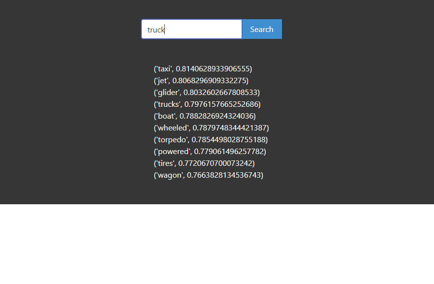

# Word2Vec Demo
A demo of Word2Vec. 



## How To Install In a Windows Environment
```
git clone https://github.com/wilfredogaldamez/Word2VecDemo.git
cd Word2VecDemo
pip -r install requirements.txt
python app.py
```

## Usage
After starting the development server, navigate to localhost:5000 on a browser and enter single common english words to view 'similar' words

## WIP
Creating a German Version
Creating an analogy function (Example: King – Man + Woman = Queen)
Error handling (mispelled words, uncommon names)


